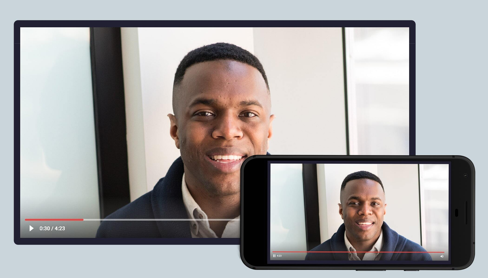

# Video SDK video on demand react api example

This code sample demonstrates a [Video On Demand API](https://docs.videosdk.live/docs/overview/video-on-demand/introduction) using react js.

- Built for serverless video on demand experience.
- Convert video from 240p to 4k.
- 98% device support.
- Low latecncy across the globe.
- Built for scale
- Adaptive video streaming



## Features

- [x] Upload large video files
- [x] Get video metadata in milliseconds.
- [x] Instant video encoding from 240p to 4k
- [x] Support multiple file and compression formats
- [x] Generate HD thumbnail images from video files.
- [x] Get notified when encoding is finished.
- [ ] protected video streaming
- [ ] 360 video support
- [ ] Embeded video players

## Device support

Visit our official [documentation](http://localhost:3000/docs/overview/video-on-demand/introduction) for more information.

## Prerequisites

You must have the following installed:

- Node JS
- NPM

## Running the Authentication server

Follow [videosdk-rtc-nodejs-sdk-example](https://github.com/videosdk-live/videosdk-rtc-nodejs-sdk-example) to run authentication server.

## Running the app

To run the app, first install the dependencies and then run the server.

```sh
$ npm install
$ npm start
```

For more information, visit [official documentation](http://localhost:3000/docs/overview/video-on-demand/introduction)
